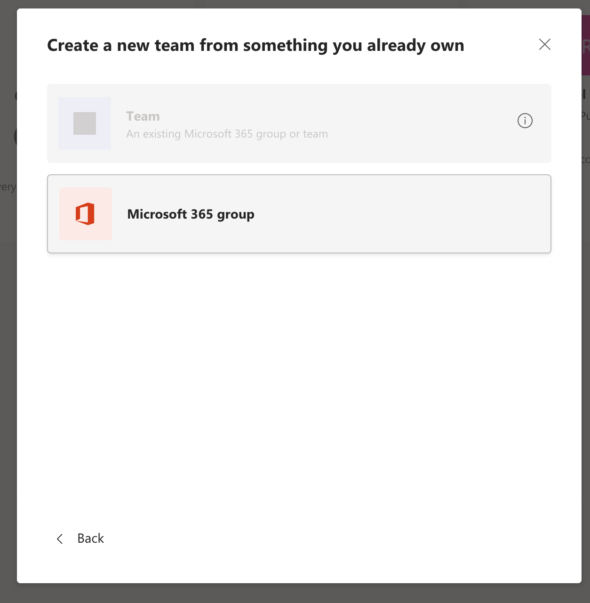

# Create and Manage an Office365 Group w/ Teams from the Outlook Web App

Groups in Microsoft 365 let you choose a set of people that you wish to collaborate with and easily set up a collection of resources for those people to share. Resources such as a shared Outlook inbox, shared calendar or a document library for collaborating on files.

While you’re considering the options it’s important to remember that one size rarely fits all. Different teams may prefer to work different ways and Microsoft 365 has the tools to enable collaboration in whatever form your teams prefer.

- If your team prefers to collaborate via email and needs a shared calendar: Create a Microsoft 365 Group in Outlook.

- If your team wants to collaborate in a persistent chat environment or use embedded apps: Create a Microsoft Team.

- If you want to create a large, open, discussion forum for your company - for example for executive-level announcements and discussions: Create a group in Yammer.

In this guide we are going to learn how to create an Office 365 Group in Outlook then link it to a Teams Team.

>Please note that this functionality *SHOULD* be available from desktop Outlook but its not currently working. If you try and click on Create Group or Manage Group from within the Desktop app the program wont take you anywhere. Using the Outlook Web App is a great work around (and currently the only way) for people to set up and manage groups. They WILL show up in the Desktop App after being created.

## Creating New Groups

Open Outlook for Web: https://outlook.office.com/mail/inbox

In the left pane, under Groups, select New group or right-click Groups and select New group.

    

Fill out group information:

**Group name:** Create a name that captures the spirit of the group.

Once you enter a name, a suggested email address is provided. "Not available" means the group name is already in use and you should try a different name. Note that once you choose a group name, it cannot be changed.

- **Description:** Optionally, enter a description that will help others understand the group's purpose. This description will be included in the welcome email when others join the group.

**Privacy:** By default, groups are created as Private. This means only approved members in your organization can see what's inside the group. Anyone else in your organization who is not approved cannot see what's in the group.

- Select **Public** to create a group where anyone within your organization can view its content and become a member.

- Select **Private** to create a group where membership requires approval and only members can view group content.

- **Send all group conversations and events to members' inboxes** Optionally, check this box to enable members to see all group conversations and events in their inbox without having to visit separate group workspaces. Members can change this setting for their own mailboxes.

Select **Create**.

### Add Teams to Your New Group

If you created, or are the owner of a group you can Create a new Teams Team attached to this group. Add Teams to your group for easy group chat and calls!

Open Teams and click on "Teams" in the left column. Click "Create a Team".

Click "From a group or team"

Click "Microsoft 365 Group"

Select Your group from the list and then click "Create"

> **Important:** Please take note the Group you created in Outlook and the Team are now permenantly linked together. If you delete the group from Teams it will also delete all associated data in Outlook and across the rest of O365 for the group.

###### Now not only will you have group emails, calendars and file shares but also group chat!

*If you need more help please contact the IT department for assistance!*

## Managing Groups and Members
Open Outlook  on the web: https://outlook.office.com/mail/inbox

In the left hand column click on Manage Groups

    

In the "Groups" header in the left hand column you will see Member, Owner, and Deleted. These refer to groups that you are either a Member Of, Owner Of, or Deleted Groups. If you select "Member" you will see all the groups that you are a member of in the the middle column. If you are looking for a group you recently created or are an owner of then you would want to select "Owner".  From there you can add users in the right hand window. You are also able to see files and emails that have been sent to the group by selecting the appropriate tab in the right hand window. Unchecking "Follow in inbox" will prevent new messages from coming to your inbox.

##### *If you need more help please contact the IT department for assistance!*

support@drmich.org