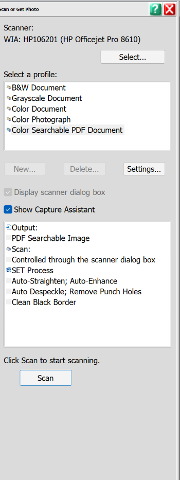

# What to Do When Your PDFs are Too Big to Send!

When scanning and emailing large documents sometimes we can run into issues being able to send those files to some email addresses. Most providers will have no issue as long as its under 25MB but smaller providers or those who self host may not be able to receive anything over 7-10MB. Knowing this there is a few things we can do to either reduce the file size from the beginning while scanning or a few options for reducing an already created and unwieldy PDF file.
 
 
## Scanning Options

### Input
The color options are, not surprisingly the largest offender when it comes to file size. MOST documents do not need to be scanned in color. There is no value or need for example, to scan a document in color just because of a color letterhead or a signature signed with a blue pen. In most case these documents will be fine being scanned in B&W. Especially large documents. Grayscale can eat up almost as much space however is a little more efficient than color is you have a document with a lot of graphics and light lines that you need to accurately reproduce. Below are common recommended settings for DPI (dots per sq inch) and color settings.
100-200 dpi color or 200 dpi grayscale is recommended for photographs orpictures that will be displayed in web pages.
Pictures or photos destined for printing or DTP work usually need higherresolutions.
300 DPI is recommended for documents destined for OCR text extraction. (Search and Editable PDF File)
To OCR poor quality documents prefer 300 DPI grayscale scanning.For documents with very small text, 400 DPI black & white scanning may be best.

### Output

The PDF file. Most applications allow for only very basic PDF save settings. Usually this is a High, Med, Low compression setting. For most  cases medium will be fine. Making the document searchable does NOT carry the same heavy file size overhead that color and gray scale do. Everyone likes a searchable PDF.  If you are having issues with a particularly large file then to can try scanning in black and high first then trying a higher compression level which produces the smallest file size. However, we have options for compressing the file further after it's created if need be. We will go over those later.

If you are an employee that has a scanner and their desk and regularly have issues with PDF file sizes and none of these options are going to help you in a way that is productive, please send us an email so we can see about tweaking some of the default scan settings in your program.
 
 
## Adobe Acrobat Pro

If you are using Acrobat Pro or Acrobat DC Pro then a flurry of new options open up. Including options to optimize the file which will reduce the file size and can also perform OCR at the same time. There is also options to simply further compress the file.  

**The Reduce Size feature**. In Acrobat Pro, choose File > Save As Other > Reduced Size PDF. OK. Save as a new file name (so you still have the original elsewhere). Check the size of the resulting file and compare to the original file. It should be less than half the size of the original. If it is small enough you are done. 

**PDF Optimizer**. If the file is still too large after performing Step 1 above, try the PDF Optimizer. In Acrobat Pro, choose File > Save As Other > Optimized PDF Go to Settings in the window that opens and select Custom, and change the Downsample to 75 ppi for both Color and Grayscale Images. That should substantially reduce file size. See image below. After reducing file save, open the new smaller file, and review the content to make sure formatting has not been compromised. Occasionally, reducing file size might alter some of the layout, format, or images.

 
 
## Adobe Online Compression Tool

Adobe now offers a free online compression tool. HERE  This tool allows you to either drag and drop or select the PDF document you need to shrink and then processes the document and allows you to download your new smaller file. This is cumbersome but likely the easiest and most foolproof way to shrink and existing file that you have been struggling to send. It also doesn't require any additional or special software that you may or may not have. If you find yourself using this tool often please contact IT support for a better solution.

 

## Share Over the Cloud w/ OneDrive
Using OneDrive, simply share a link to the file with the client or persons which you need to send the file to. If OneDrive is configured on your PC then its as simple as finding the file you want to share and dragging it to your OneDrive folder if its not already there. Then right click  > OneDrive > Share.
 

>If OneDrive is NOT configured on your PC please contact us to get that taken care of. Signing in is an easy process, the install asks some configuration questions that would best be addressed by IT for data backup reasons. 

 Click [HERE](mailto:support@drmich.org) to send email to Support now!

 

## DocuSign

DocuSign also allows you to transfer large document via the cloud. Now each document, or as DS calls them, "Envelopes" is a billable, think of it like a digital stamp. So this isn't a solution for everyday document transmission, but if the document does need to be signed or is important enough to require an audit trail then this is the solution.
More to come later on DocuSign!

## Still Need Some Help???
If you are still stuck with a file that's too big to send, or have trouble with any of the steps above, please contact support@drmich.org for assistance. 

## Resources

- A Site dedicated to the PDF file format will more nerdy info than anyone could ever need about a single file format. They also have best practices for scanning and processing PDF files. 

https://talkingpdf.org/key-best-practices-for-document-scanning/

- Adobe Acrobat Online Compression Tool 

https://documentcloud.adobe.com/link/acrobat/compress-pdf

- Adobes (Very indepth) Guide on Optimzing PDF Files in Acrobat Pro

https://helpx.adobe.com/acrobat/using/optimizing-pdfs-acrobat-pro.html

- Microsoft OneDrive Online - You can directly upload to the site and share the file from there if OneDrive is not installed on your PC.

https://mpasorg.onedrive.com

- A document from the US courts that has some really great info on PDF optimization as well as file size comparisons.

https://ksd.uscourts.gov/wp-content/uploads/2016/10/6-24-13-Optimization-of-PDF-Files-to-Reduce-File-Size.pdf
